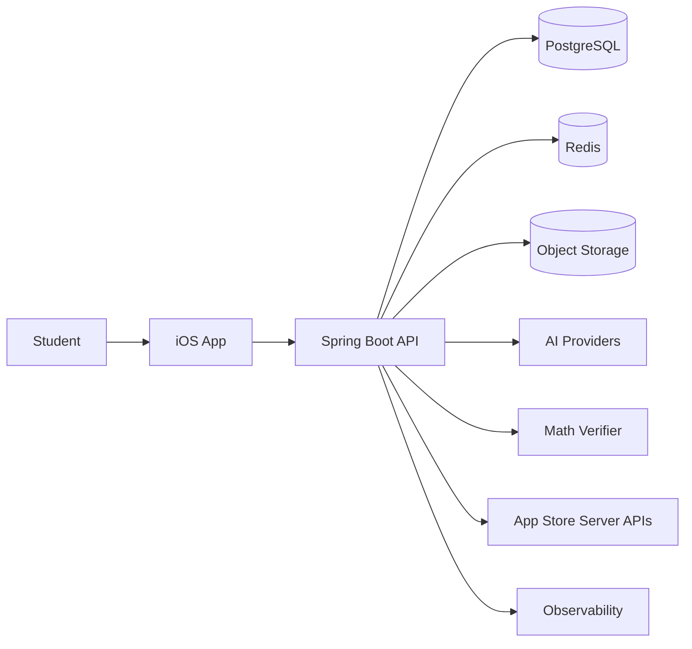

# System Architecture Overview

## Architectural goal

Support a polished iOS product today while preserving explicit domain boundaries for future Android/web clients and future scale. Priorities are correctness, auditability, provider replaceability, maintainability and evolutionary scaling.

## System context

## Phase 1 Runtime Boundary Matrix

| Boundary | Direction | Allowed? | Trust level | Source of truth impact | Secret handling |
|---|---|---|---|---|---|
| Student -> iOS App | Local device interaction | Yes | Untrusted user input | None until backend accepts command | No server/provider secrets. |
| iOS App -> Spring Boot API | HTTPS public API | Yes | Authenticated but still user-controlled | Backend validates and persists accepted state | Access/refresh tokens only; no provider keys. |
| iOS App -> AI Provider | Direct external call | Forbidden | Would bypass backend policy | None allowed | Provider keys prohibited in iOS. |
| iOS App -> Math Verifier | Direct internal call | Forbidden | Would expose internal verifier | None allowed | Internal verifier credentials never shipped to client. |
| iOS App -> PostgreSQL/Redis | Direct data access | Forbidden | Would bypass authorization and invariants | None allowed | Database/cache credentials never shipped to client. |
| iOS App -> Object Storage | Presigned upload/download only after backend authorization | Conditional | Object access scoped to one authorized asset | Object metadata remains backend/PostgreSQL authoritative | Presigned URLs are short-lived and scoped. |
| Spring Boot API -> PostgreSQL | Private network | Yes | Trusted service boundary | Canonical durable application state | Server-side managed credentials only. |
| Spring Boot API -> Redis | Private network | Yes | Disposable support infrastructure | No canonical learning/billing/verification state | Server-side managed credentials only. |
| Spring Boot API -> Object Storage | Private/control plane plus presigned URL issuance | Yes | Backend-authorized storage | Binary assets; metadata in PostgreSQL | Server-side storage credentials only. |
| Spring Boot API -> AI Provider | Provider adapter only | Yes | External untrusted output | AI output requires validation and policy acceptance | Provider secrets in server secret manager only. |
| Spring Boot API -> Math Verifier | Internal private API | Yes | Deterministic evidence service | Returns evidence; does not own student state | Internal service auth only. |
| Math Verifier -> PostgreSQL | General application data access | Should not | Would blur product authority | No canonical data ownership | No database credentials by default. |
| Spring Boot API -> Apple Services | Server validation/notifications | Yes | External authoritative purchase evidence | Billing module updates entitlement after validation | Server-side App Store credentials only. |
| Spring Boot API -> Observability | Telemetry export | Yes | Operational metadata only | No product state authority | Redact secrets and raw student content. |

## Runtime Ownership Baseline

- iOS owns presentation, capture UX, local cache, and offline projections.
- Spring Boot owns product authority, orchestration, API contracts, authorization, verification policy, billing/entitlement, learning state, and durable jobs.
- PostgreSQL owns canonical durable product data.
- Redis owns cache/rate-limit/lock acceleration only.
- Object storage owns binary assets; PostgreSQL owns asset metadata and lifecycle state.
- External AI providers own probabilistic capability execution but no product truth.
- Math verifier owns deterministic math checks and evidence but no identity, billing, mastery, or problem-session authority.
- Observability systems own operational diagnosis records, never unrestricted raw student content.

## iOS client responsibilities

- UI and navigation,
- camera/gallery input,
- local cache/offline projections,
- token storage,
- StoreKit purchase UX,
- presentation of solution, verification and learning state.

It does **not**:
- hold model provider secrets,
- decide entitlement authoritatively,
- assign mastery,
- assign VERIFIED.

## Spring Boot backend responsibilities

- authentication and sessions,
- authorization,
- domain orchestration,
- AI model routing,
- problem lifecycle,
- verification policy,
- mistake/mastery/planner logic,
- billing and entitlement,
- durable async work,
- API contracts,
- audit and operational telemetry.

## PostgreSQL

Canonical source of truth for identity, curriculum, problem metadata, parse revisions, solutions, verification, attempts, mistakes, mastery, study plans, exams, billing, AI usage and audit.

## Redis

Ephemeral infrastructure for rate limits, hot cache, locks and optional progress acceleration. All critical state survives Redis loss.

## Object storage

Stores raw/processed images, PDFs and other binary assets. Prefer direct presigned upload from the iOS client after backend authorization.

## Math verifier

Internal Python/FastAPI service using SymPy/NumPy. It owns no student source-of-truth data and is never directly reachable from iOS.

## AI providers

External capabilities behind internal `AiModelGateway`. Provider/model choice is runtime policy based on task, cost, quality, entitlement and provider health.

## Architectural styles

Backend:
- modular monolith,
- DDD-inspired bounded contexts,
- ports/adapters at external boundaries,
- events for post-commit module reactions.

iOS:
- feature-first organization,
- SwiftUI + Observation/MVVM,
- repositories/use cases where behavior is non-trivial,
- async/await.

## Evolution path

1. One main API deployment + managed PostgreSQL/Redis/storage.
2. Horizontal API scaling.
3. External durable queue if database-backed jobs become insufficient.
4. Extract AI/notification/reporting only when measurable operational needs justify it.

Do not pre-pay microservice complexity.

<!-- HYBRID_AI_STRATEGY_V3:START -->
## Hybrid AI architecture evolution

Production V1 uses external API adapters plus the internal Python/SymPy verifier. The architecture deliberately exposes a stable `AiCapabilityPort` so future small proprietary models can be added without changing feature/domain contracts.

Future optional components such as `ml-training` or `model-inference` are **conditional deployments** activated only after Phase 13 readiness gates. They are not required for V1 and must not increase early operational complexity.
<!-- HYBRID_AI_STRATEGY_V3:END -->
