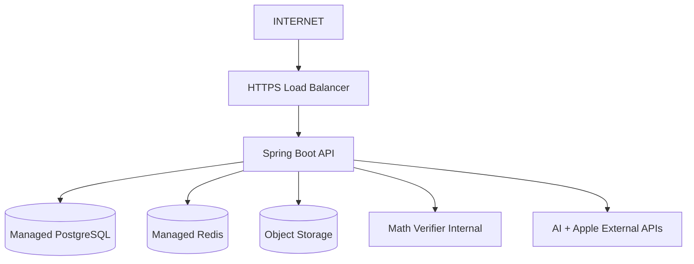

# Runtime and Deployment Architecture

## Environments

### Local
Docker Compose:
- PostgreSQL,
- Redis,
- MinIO,
- Spring API,
- math-verifier.

AI adapters can run against real development keys or stubs.

### CI/Test
- Testcontainers PostgreSQL,
- ephemeral service containers,
- mocked provider contracts for deterministic tests,
- separate real-model AI evaluation jobs.

### Staging
Production-like managed environment with isolated database, secrets, billing sandbox and AI configuration.

### Production
Managed PostgreSQL, managed Redis, object storage, containerized API and verifier, secret management and observability.

## Network model

Only the load balancer/API ingress is public. PostgreSQL, Redis and verifier remain private.

## Stateless API

API instances should not depend on local in-memory state for correctness. Session/token authority is stored server-side as necessary; jobs and learning state are durable.

## Scaling

- Add API replicas for HTTP load.
- Scale verifier independently for CPU-heavy symbolic work.
- Connection pool limits are coordinated with DB capacity.
- Bound outbound concurrency to external model providers.

## Health endpoints

Liveness: process/runtime.
Readiness: essential dependencies with careful degradation semantics.

Do not mark the whole API unavailable because one AI provider is degraded when a fallback route exists.

## Database resilience

- encrypted transport/storage,
- automated backup,
- point-in-time recovery,
- migration validation,
- connection pool monitoring,
- restore exercises.

## Deployment

Initial safe flow:
1. Build immutable image.
2. Run tests/evaluation gates.
3. Deploy staging.
4. Smoke test.
5. Promote production.
6. Observe SLO/error/AI quality metrics.
7. Roll back code/config/model route if thresholds fail.

## Configuration

- secrets via secret manager/environment,
- typed configuration,
- no production secret in repository,
- feature flags/model routes externalized,
- environment-specific URLs and limits.

## Resource safeguards

- bounded thread/connection pools,
- HTTP timeouts,
- circuit breakers,
- AI concurrency budgets,
- upload size limits,
- verifier complexity/time limits.

## Disaster recovery

Define and test RPO/RTO rather than leaving aspirational values in code. Restore procedure belongs in operational runbooks.

<!-- HYBRID_AI_STRATEGY_V3:START -->
## Optional future model-serving runtime

The default runtime contains no self-hosted generative model service. If a proprietary model later passes TCO/quality gates, it is deployed behind a private inference adapter with independent autoscaling, metrics, capacity limits and external API fallback.

The system must be able to disable that runtime through routing configuration without an iOS release.
<!-- HYBRID_AI_STRATEGY_V3:END -->
